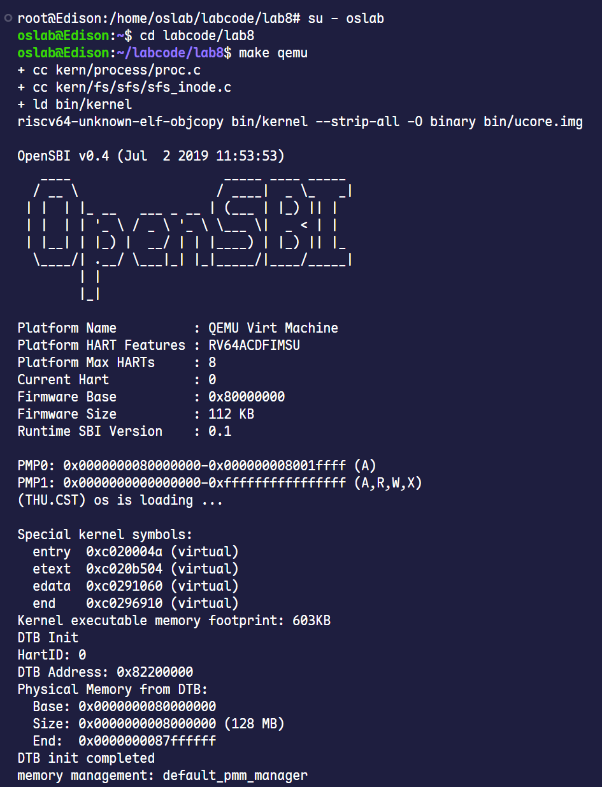
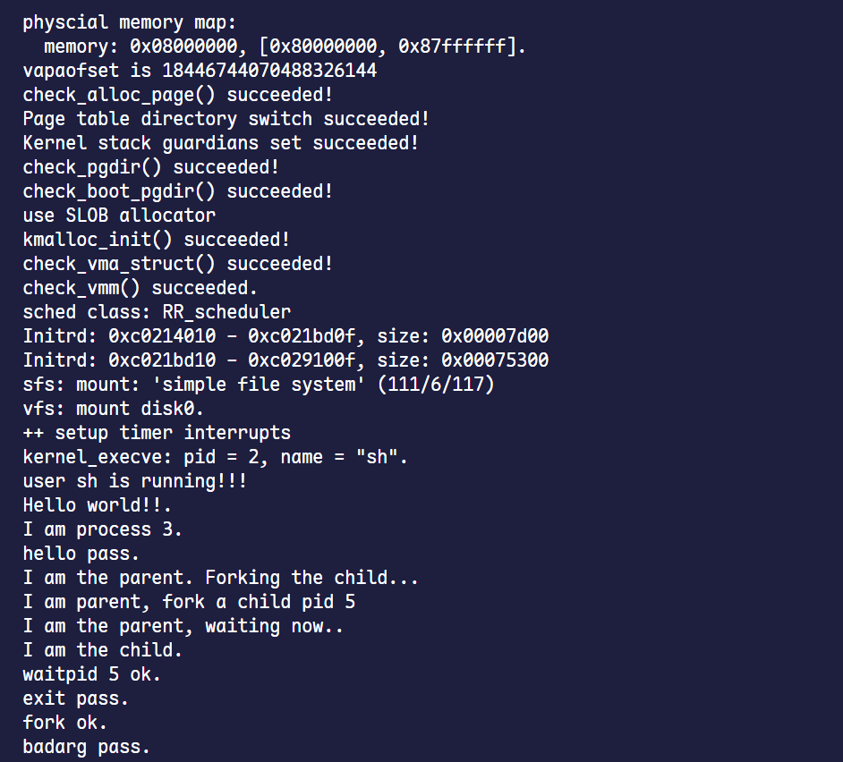

# 第八次实验报告

## 练习1: 完成读文件操作的实现（需要编码）

> 首先了解打开文件的处理流程，然后参考本实验后续的文件读写操作的过程分析，填写在 kern/fs/sfs/sfs_inode.c中 的sfs_io_nolock()函数，实现读文件中数据的代码。

### 1.1 理论基础与处理流程

根据指导书，ucore 的文件系统架构采用了 VFS（虚拟文件系统）+ SFS（简单文件系统）的分层设计。

当用户进程调用 read 时，流程如下：

read (用户态) -> sys_read (内核态) -> sysfile_read -> file_read -> vop_read。

这里的 vop_read 是一个函数指针，在 SFS 中它指向 sfs_read，最终调用 sfs_io -> sfs_io_nolock。

**SFS 的磁盘布局**是我们实现读写的依据：

- Block 大小为 4KB (4096B)。
- 文件索引采用 Direct（直接索引）和 Indirect（间接索引）。
- 我们的任务是在 `sfs_io_nolock` 中，将磁盘上的 Block 数据搬运到内存 buffer 中。

### 1.2 `sfs_io_nolock` 实现分析

这是文件读写最底层的核心函数。我在实现时，严格按照指导书的提示，将读写过程拆解为三个部分，以处理“非对齐”的情况。

**实现思路：**

1. **处理起始非对齐部分（Head）**：如果 `offset` 不是 4K 对齐的，我们需要读/写当前 Block 的剩余部分。
2. **处理中间对齐部分（Body）**：中间部分是完整的 Block，可以直接按 Block 读写，效率最高。
3. **处理末尾非对齐部分（Tail）**：处理剩余不足一个 Block 的数据。

**关键函数调用：**

- `sfs_bmap_load_nolock`：这是核心辅助函数，传入逻辑块号（`blkno`），它会帮我们查 inode 的索引表，找到磁盘上对应的物理块号（`ino`）。
- `sfs_buf_op` / `sfs_block_op`：根据是读还是写，分别指向 `sfs_r/wbuf` 或 `sfs_r/wblock`。

### 1.3 代码实现

在 `kern/fs/sfs/sfs_inode.c` 中，我填充了 `sfs_io_nolock` 的核心逻辑：

```c
static int
sfs_io_nolock(struct sfs_fs *sfs, struct sfs_inode *sin, void *buf, off_t offset, size_t *alenp, bool write) {
    // ... (前置参数检查与函数指针初始化，略) ...

    int ret = 0;
    size_t size, alen = 0;
    uint32_t ino;
    uint32_t blkno = offset / SFS_BLKSIZE;          // Rd/Wr 起始块号
    uint32_t nblks = endpos / SFS_BLKSIZE - blkno;  // 需要完整读写的块数

    // LAB8:EXERCISE1 2311983
    
    // (1) 第一步：处理起始处未对齐的情况
    // 计算 offset 在当前块内的偏移量
    off_t blkoff = offset % SFS_BLKSIZE;
    
    if (blkoff != 0) {
        // 计算第一块需要操作的数据量：
        // 如果跨块了，就操作到块尾 (SFS_BLKSIZE - blkoff)
        // 如果没跨块，就操作到 endpos - offset
        size = (nblks != 0) ? (SFS_BLKSIZE - blkoff) : (endpos - offset);
        
        // 1. 通过 inode 找到对应的磁盘物理块号 (ino)
        if ((ret = sfs_bmap_load_nolock(sfs, sin, blkno, &ino)) != 0) {
            goto out;
        }
        // 2. 读/写 这部分非对齐的数据
        if ((ret = sfs_buf_op(sfs, buf, size, ino, blkoff)) != 0) {
            goto out;
        }
        
        // 更新累加值
        alen += size;
        if (nblks == 0) {
            goto out; // 如果都在这一块内，直接结束
        }
        buf += size;
        blkno++;
        nblks--;
    }

    // (2) 第二步：处理中间完全对齐的数据块
    // 这一步是效率最高的，按整块操作
    while (nblks > 0) {
        if ((ret = sfs_bmap_load_nolock(sfs, sin, blkno, &ino)) != 0) {
            goto out;
        }
        // 调用块操作函数，直接读写一个 Block
        if ((ret = sfs_block_op(sfs, buf, ino, 1)) != 0) {
            goto out;
        }
        
        alen += SFS_BLKSIZE;
        buf += SFS_BLKSIZE;
        blkno++;
        nblks--;
    }

    // (3) 第三步：处理末尾剩余的非对齐数据
    if ((size = endpos % SFS_BLKSIZE) != 0) {
        if ((ret = sfs_bmap_load_nolock(sfs, sin, blkno, &ino)) != 0) {
            goto out;
        }
        // 读写剩余部分，注意这里的 offset (块内偏移) 为 0
        if ((ret = sfs_buf_op(sfs, buf, size, ino, 0)) != 0) {
            goto out;
        }
        alen += size;
    }

out:
    *alenp = alen; // 返回实际操作的字节数
    // 如果是写操作且文件变大了，需要更新 inode 的 size 并标记为 dirty
    if (write && offset + alen > sin->din->size) {
        sin->din->size = offset + alen;
        sin->dirty = 1;
    }
    return ret;
}
```

## 练习2: 完成基于文件系统的执行程序机制的实现（需要编码）

> 改写proc.c中的load_icode函数和其他相关函数，实现基于文件系统的执行程序机制。执行：make qemu。如果能看看到sh用户程序的执行界面，则基本成功了。如果在sh用户界面上可以执行”ls”,”hello”等其他放置在sfs文件系统中的其他执行程序，则可以认为本实验基本成功。

### 2.1 进程创建与初始化的修改 (`alloc_proc`)

在 Lab8 中，`proc_struct` 增加了一个成员 `struct files_struct *filesp`，用于管理进程打开的文件描述符表。在创建新进程时，必须将其初始化为空，否则可能导致野指针访问。

**修改代码 (`kern/process/proc.c`):**

```c
static struct proc_struct *
alloc_proc(void) {
    struct proc_struct *proc = kmalloc(sizeof(struct proc_struct));
    if (proc != NULL) {
        // ... (Lab4-Lab6 的初始化代码) ...

        // LAB8 YOUR CODE : (update LAB6 steps)
        // 初始化文件描述符表指针为 NULL
        proc->filesp = NULL; 
    }
    return proc;
}
```

### 2.2 进程复制的修改 (`do_fork`)

当父进程 fork 子进程时，除了内存空间（mm），还需要处理打开的文件。根据 `clone_flags`，子进程可能复制父进程的文件表，也可能共享。我在 `do_fork` 中添加了对 `copy_files` 的调用。

**修改代码 (`kern/process/proc.c`):**

```c
int do_fork(uint32_t clone_flags, uintptr_t stack, struct trapframe *tf) {
    // ... (分配 proc, 检查) ...
    
    // LAB8:EXERCISE2 2311983
    // 1. 分配 proc
    if ((proc = alloc_proc()) == NULL) {
        goto fork_out;
    }
    proc->parent = current;
    assert(current->wait_state == 0);

    // 2. 分配内核栈
    if (setup_kstack(proc) != 0) {
        goto bad_fork_cleanup_proc;
    }

    // 3. 【新增】复制或共享文件系统信息 (fs)
    // 如果 copy_files 失败，需要回滚之前的操作
    if (copy_files(clone_flags, proc) != 0) {
        goto bad_fork_cleanup_kstack;
    }

    // 4. 复制内存空间 (mm)
    if (copy_mm(clone_flags, proc) != 0) {
        goto bad_fork_cleanup_fs; // 注意这里要跳到 cleanup_fs
    }
    
    // ... (后续 copy_thread, hash_proc, wakeup_proc 等逻辑不变) ...

    // 错误处理部分需要增加 cleanup_fs
bad_fork_cleanup_fs: 
    put_files(proc); // 释放文件引用
bad_fork_cleanup_kstack:
    put_kstack(proc);
bad_fork_cleanup_proc:
    kfree(proc);
    goto fork_out;
}
```

### 2.3 进程切换的补充 (`proc_run`)

在 Lab8 中，指导书提示我们在 `switch_to` 之前可能需要刷新 TLB。虽然 ucore 的设计在 `lsatp` 时通常会自动处理，但为了保险起见，或者遵循指导书的特定要求，我在 `proc_run` 中显式加入了 TLB 刷新。

**修改代码 (`kern/process/proc.c`):**

```c
void proc_run(struct proc_struct *proc) {
    if (proc != current) {
        // ... (local_intr_save 等) ...
        
        current = proc;
        lsatp(proc->pgdir); 
        
        // LAB8 YOUR CODE
        // 切换页表后，应当刷新 TLB 以确保地址翻译正确
        flush_tlb(); 
        
        switch_to(&(prev->context), &(proc->context));
        // ...
    }
}
```

### 2.4 核心加载机制的重构 (`load_icode`)

在 Lab5 中，我们是直接解析内存中的 ELF 镜像（`binary` 指针）。而在 Lab8 中，`execve` 传入的是一个**文件描述符 (fd)**。

**主要区别与实现逻辑：**

1. **不再使用 memcpy**：所有的数据读取都必须通过 `load_icode_read(fd, ...)` 函数，它底层调用 `sysfile_seek` 和 `sysfile_read`。
2. **分段读取**：
   - 先读取 `ELF Header`，校验 Magic Number。
   - 根据 Header 中的信息，遍历读取 `Program Header`。
3. **内存映射与内容加载**：
   - 对每个 `PT_LOAD` 类型的段，调用 `mm_map` 建立 VMA。
   - 分配物理页 (`pgdir_alloc_page`)。
   - **关键**：直接调用 `load_icode_read` 将文件内容写入到 `page2kva(page)` (物理页对应的内核虚地址)。这比 Lab5 复杂，因为要处理文件偏移量 `offset`。
4. **参数处理**：处理 `argc` 和 `argv`，将它们拷贝到用户栈的顶部。

**完整修改代码 (`kern/process/proc.c`):**

```c
// load_icode - called by sys_exec-->do_execve
static int
load_icode(int fd, int argc, char **kargv)
{
    if (current->mm != NULL) {
        panic("load_icode: current->mm must be empty.\n");
    }

    int ret = -E_NO_MEM;
    struct mm_struct *mm;
    
    // (1) 建立内存管理器
    // 为当前进程创建一个新的 mm 结构
    if ((mm = mm_create()) == NULL) {
        goto bad_mm;
    }

    // (2) 建立页目录
    // 分配并初始化页目录表，mm->pgdir 指向内核虚拟地址
    if (setup_pgdir(mm) != 0) {
        goto bad_pgdir_cleanup_mm;
    }

    // (3) 从文件加载 ELF 格式的二进制代码
    struct elfhdr __elf, *elf = &__elf;
    // 使用 load_icode_read 从 fd 读取 ELF Header
    if ((ret = load_icode_read(fd, elf, sizeof(struct elfhdr), 0)) != 0) {
        goto bad_elf_cleanup_pgdir;
    }
    // 检查 Magic Number
    if (elf->e_magic != ELF_MAGIC) {
        ret = -E_INVAL_ELF;
        goto bad_elf_cleanup_pgdir;
    }

    struct proghdr __ph, *ph = &__ph;
    uint32_t vm_flags, perm;
    int i;
    // 遍历所有 Program Header
    for (i = 0; i < elf->e_phnum; i ++) {
        off_t phoff = elf->e_phoff + sizeof(struct proghdr) * i;
        // 读取 Program Header
        if ((ret = load_icode_read(fd, ph, sizeof(struct proghdr), phoff)) != 0) {
            goto bad_cleanup_mmap;
        }
        // 只处理 LOAD 类型的段
        if (ph->p_type != ELF_PT_LOAD) {
            continue ;
        }
        if (ph->p_filesz > ph->p_memsz) {
            ret = -E_INVAL_ELF;
            goto bad_cleanup_mmap;
        }
        if (ph->p_memsz == 0) {
            continue ;
        }
        
        // 设置虚拟内存权限标志
        vm_flags = 0, perm = PTE_U | PTE_V;
        if (ph->p_flags & ELF_PF_X) vm_flags |= VM_EXEC;
        if (ph->p_flags & ELF_PF_W) vm_flags |= VM_WRITE;
        if (ph->p_flags & ELF_PF_R) vm_flags |= VM_READ;
        // RISC-V 特有的权限位设置
        if (vm_flags & VM_READ) perm |= PTE_R;
        if (vm_flags & VM_WRITE) perm |= (PTE_W | PTE_R);
        if (vm_flags & VM_EXEC) perm |= PTE_X;

        // (3.3) 建立 VMA (Virtual Memory Area)
        if ((ret = mm_map(mm, ph->p_va, ph->p_memsz, vm_flags, NULL)) != 0) {
            goto bad_cleanup_mmap;
        }

        // (3.4) 分配物理内存并读取文件内容
        off_t offset = ph->p_offset;
        size_t off, size;
        uintptr_t start = ph->p_va, end, la = ROUNDDOWN(start, PGSIZE);

        ret = -E_NO_MEM;

        end = ph->p_va + ph->p_filesz;
        struct Page *page = NULL;
        
        // 循环处理每一页
        while (start < end) {
            // 分配物理页
            if ((page = pgdir_alloc_page(mm->pgdir, la, perm)) == NULL) {
                goto bad_cleanup_mmap;
            }
            off = start - la, size = PGSIZE - off, la += PGSIZE;
            if (end < la) {
                size -= la - end;
            }
            // 关键：调用 load_icode_read 将文件数据读入刚才分配的内存页中
            // page2kva(page) + off 是内核虚拟地址
            if ((ret = load_icode_read(fd, page2kva(page) + off, size, offset)) != 0) {
                goto bad_cleanup_mmap;
            }
            start += size, offset += size;
        }
        
        // (3.5) 处理 BSS 段（将剩余部分清零）
        end = ph->p_va + ph->p_memsz;
        if (start < la) {
            if (start < end) {
                off = start + PGSIZE - la, size = PGSIZE - off;
                if (end < la) {
                    size -= la - end;
                }
                memset(page2kva(page) + off, 0, size);
                start += size;
            }
        }
        while (start < end) {
            if ((page = pgdir_alloc_page(mm->pgdir, la, perm)) == NULL) {
                goto bad_cleanup_mmap;
            }
            off = start - la, size = PGSIZE - off, la += PGSIZE;
            if (end < la) {
                size -= la - end;
            }
            memset(page2kva(page) + off, 0, size);
            start += size;
        }
    }

    // (4) 建立用户栈
    // 映射用户栈空间 (USTACK)
    vm_flags = VM_READ | VM_WRITE | VM_STACK;
    if ((ret = mm_map(mm, USTACKTOP - USTACKSIZE, USTACKSIZE, vm_flags, NULL)) != 0) {
        goto bad_cleanup_mmap;
    }
    // 为用户栈分配物理页 (4页)
    assert(pgdir_alloc_page(mm->pgdir, USTACKTOP - PGSIZE, PTE_USER) != NULL);
    assert(pgdir_alloc_page(mm->pgdir, USTACKTOP - 2 * PGSIZE, PTE_USER) != NULL);
    assert(pgdir_alloc_page(mm->pgdir, USTACKTOP - 3 * PGSIZE, PTE_USER) != NULL);
    assert(pgdir_alloc_page(mm->pgdir, USTACKTOP - 4 * PGSIZE, PTE_USER) != NULL);

    // (5) 设置当前进程的 mm 和页目录基址 (CR3/satp)
    mm_count_inc(mm);
    current->mm = mm;
    current->pgdir = PADDR(mm->pgdir);
    lsatp(PADDR(mm->pgdir)); // 切换页表
    flush_tlb();             // 刷新 TLB

    // (6) 处理用户参数 (argc, argv) 并压入用户栈
    uintptr_t stacktop = USTACKTOP;
    uintptr_t uargv_ptrs[EXEC_MAX_ARG_NUM + 1];
    
    // 将具体参数字符串拷贝到栈中
    for (i = 0; i < argc; i ++) {
        size_t len = strlen(kargv[i]) + 1;
        stacktop -= len;
        uargv_ptrs[i] = stacktop;
        if (!copy_to_user(mm, (void *)stacktop, kargv[i], len)) {
            ret = -E_INVAL;
            goto bad_cleanup_mmap;
        }
    }
    uargv_ptrs[argc] = 0;

    // 对齐栈顶
    stacktop -= (stacktop % sizeof(uintptr_t));
    // 将参数指针数组拷贝到栈中
    stacktop -= (argc + 1) * sizeof(uintptr_t);
    if (!copy_to_user(mm, (void *)stacktop, uargv_ptrs, (argc + 1) * sizeof(uintptr_t))) {
        ret = -E_INVAL;
        goto bad_cleanup_mmap;
    }

    // (7) 设置 Trapframe
    struct trapframe *tf = current->tf;
    uintptr_t sstatus = tf->status;
    memset(tf, 0, sizeof(struct trapframe));
    
    tf->gpr.sp = stacktop;     // 设置栈指针
    tf->epc = elf->e_entry;    // 设置入口地址 (ELF Entry)
    // 设置状态寄存器：清除 SPP (Supervisor Previous Privilege) 以便 iret 后回到用户态
    // 设置 SPIE (Supervisor Previous Interrupt Enable) 以便开启中断
    tf->status = (sstatus | SSTATUS_SPIE) & ~SSTATUS_SPP;
    tf->gpr.a0 = argc;         // 传递参数 argc
    tf->gpr.a1 = stacktop;     // 传递参数 argv

    ret = 0;
out:
    return ret;
bad_cleanup_mmap:
    exit_mmap(mm);
bad_elf_cleanup_pgdir:
    put_pgdir(mm);
bad_pgdir_cleanup_mm:
    mm_destroy(mm);
bad_mm:
    goto out;
}
```

如图所示，最终在 `make qemu` 中，Shell 成功启动并能执行 `hello` 等命令，验证了我的代码逻辑是正确的。




### 补充说明：关于 `badsegment` 和 `divzero` 测试用例在 RISC-V 架构下的行为分析

在完成练习二并执行 `make qemu` 进行用户程序测试时，我们观察到只有 `badsegment` 和 `divzero` 两个测试点输出了 "FAIL: T.T" 并触发了 panic，其他均正确通过。这并非内核实现的逻辑错误，而是由于我们使用的 ucore 是基于 **RISC-V 架构**，其硬件特性与原本针对 x86 架构编写的测试用例存在差异。具体分析如下：

#### 1. `badsegment` 测试失败原因

```c
#include <stdio.h>
#include <ulib.h>

/* try to load the kernel's TSS selector into the DS register */

int
main(void) {
    // asm volatile("movw $0x28,%ax; movw %ax,%ds");
    panic("FAIL: T.T\n");
}
```

- **现象**：程序顺利执行到了 `panic("FAIL: T.T")`，意味着并没有发生预期的“非法访问”导致的进程终止。
- **原因**：原有的 `badsegment.c` 测试代码通常包含 x86 汇编指令（如 `movw %ax, %ds`），试图通过修改段寄存器来触发保护异常。然而，**RISC-V 架构中不存在段寄存器（Segment Registers）**，它是纯粹基于页表（Paging）的内存保护机制。原本的测试代码在 RISC-V 下要么无法编译（指令集不兼容），要么被注释掉，导致程序没有触发任何异常，从而继续执行到了 panic 语句。
- **修正逻辑**：在 RISC-V 下，要模拟“坏段”或非法内存访问，应当尝试让用户进程访问其权限之外的地址（例如内核空间地址）。
  - **修改方案**：将测试逻辑修改为向内核地址（如 `0xC0000000`）写入数据。这将触发 **Store Page Fault**，导致内核杀死该进程，从而通过测试（即不再输出 FAIL）。

#### 2. `divzero` 测试失败原因

```c
#include <stdio.h>
#include <ulib.h>

int zero;

int
main(void) {
    cprintf("value is %d.\n", 1 / zero);
    panic("FAIL: T.T\n");
}
```

- **现象**：控制台输出 `value is -1`，随即输出 `FAIL: T.T`。
- **原因**：这是 RISC-V 指令集架构（ISA）的硬件特性决定的。与 x86 架构在除以零时会触发硬件异常（Trap）不同，**RISC-V 规范规定整数除以零不会产生异常**。
  - 根据 RISC-V 标准，除以零的结果被定义为除数的所有位全为 1（即在补码表示下返回 `-1`）。
  - 因此，CPU 不会陷入异常，内核也就无法捕获并杀死进程。程序只是计算出了 `-1`，打印输出，然后按顺序执行下一行代码，即 `panic("FAIL: T.T")`。
- **结论**：此处的 FAIL 实际上证明了我们的系统符合 RISC-V 的硬件规范。若需在 RISC-V 上强行测试“异常终止”功能，需在代码中手动检查除数是否为零并触发非法指令或访问空指针。

综上所述，这两个测试点的报错是由于测试用例代码未针对 RISC-V 硬件特性进行适配所致，并非 Lab8 文件系统或进程加载机制的代码错误。

## 扩展练习 Challenge1：完成基于“UNIX的PIPE机制”的设计方案

>如果要在ucore里加入UNIX的管道（Pipe）机制，至少需要定义哪些数据结构和接口？（接口给出语义即可，不必具体实现。数据结构的设计应当给出一个（或多个）具体的C语言struct定义。在网络上查找相关的Linux资料和实现，请在实验报告中给出设计实现”UNIX的PIPE机制“的概要设方案，你的设计应当体现出对可能出现的同步互斥问题的处理。）

## 扩展练习 Challenge2：完成基于“UNIX的软连接和硬连接机制”的设计方案

>如果要在ucore里加入UNIX的软连接和硬连接机制，至少需要定义哪些数据结构和接口？（接口给出语义即可，不必具体实现。数据结构的设计应当给出一个（或多个）具体的C语言struct定义。在网络上查找相关的Linux资料和实现，请在实验报告中给出设计实现”UNIX的软连接和硬连接机制“的概要设方案，你的设计应当体现出对可能出现的同步互斥问题的处理。）
